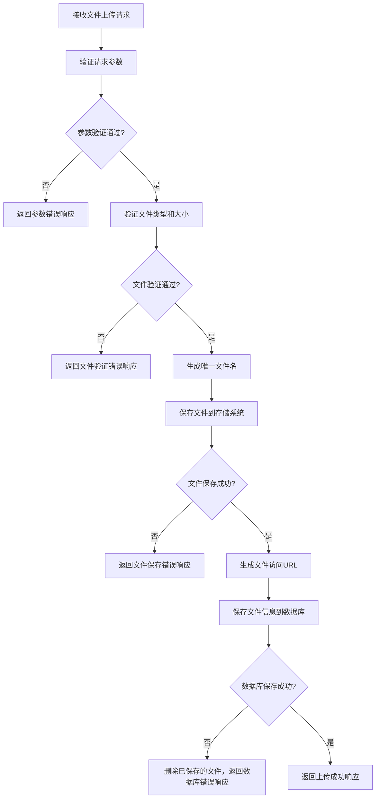
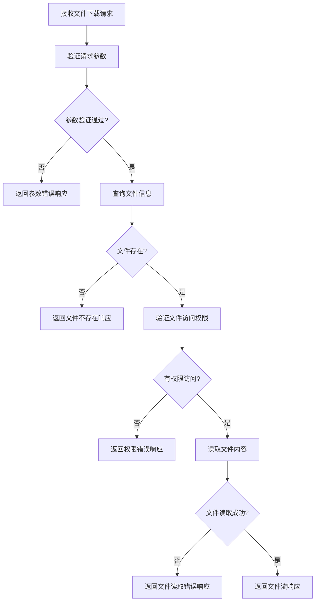

# 后端文件上传功能设计文档

## 1. 概述

本文档详细描述了案件管理系统中文件上传功能的后端设计，包括API接口、数据模型、存储方案和业务逻辑，旨在指导后端开发人员实现可靠、高效的文件上传服务。

## 2. 功能需求

- 支持单文件和多文件上传
- 支持常见文档格式（.doc, .docx, .jpg, .pdf, .png, .xls, .xlsx）
- 单个文件大小限制：10MB
- 文件与案件关联存储
- 支持文件的查询、下载和删除
- 提供文件上传、下载、删除的API接口
- 支持文件上传历史记录

## 3. 技术选型

- **存储方案**：
  - 本地文件系统（开发环境）
  - 对象存储服务（OSS，生产环境）：如阿里云OSS、腾讯云COS等
- **数据库**：MySQL
- **API风格**：RESTful API

## 4. 数据模型设计

### 4.1 文件信息表（case_files）

| 字段名 | 数据类型 | 约束 | 描述 |
|--------|----------|------|------|
| id | VARCHAR(36) | PRIMARY KEY | 文件唯一标识（UUID） |
| case_id | VARCHAR(36) | NOT NULL, FOREIGN KEY | 关联的案件ID |
| file_name | VARCHAR(255) | NOT NULL | 文件名 |
| file_path | VARCHAR(512) | NOT NULL | 文件存储路径 |
| file_url | VARCHAR(512) | NOT NULL | 文件访问URL |
| file_size | BIGINT | NOT NULL | 文件大小（字节） |
| file_type | VARCHAR(50) | NOT NULL | 文件类型（MIME类型） |
| upload_user_id | VARCHAR(36) | NOT NULL | 上传用户ID |
| upload_time | DATETIME | NOT NULL, DEFAULT CURRENT_TIMESTAMP | 上传时间 |
| update_time | DATETIME | NOT NULL, DEFAULT CURRENT_TIMESTAMP ON UPDATE CURRENT_TIMESTAMP | 更新时间 |
| is_deleted | TINYINT | NOT NULL, DEFAULT 0 | 是否删除（0: 正常, 1: 删除） |

### 4.2 索引设计

```sql
-- 案件ID索引，用于快速查询某个案件的所有文件
CREATE INDEX idx_case_files_case_id ON case_files(case_id);
-- 上传时间索引，用于按时间排序查询
CREATE INDEX idx_case_files_upload_time ON case_files(upload_time);
-- 复合索引，用于快速查询未删除的案件文件
CREATE INDEX idx_case_files_case_id_is_deleted ON case_files(case_id, is_deleted);
```

## 5. API接口设计

### 5.1 上传文件接口

#### 请求信息
- **URL**：`/api/web/uploadCaseFile`
- **方法**：`POST`
- **请求类型**：`multipart/form-data`

#### 请求参数
| 参数名 | 类型 | 位置 | 必填 | 描述 |
|--------|------|------|------|------|
| token | STRING | Query | 是 | 认证令牌 |
| SEP_ID | STRING | Query | 是 | 案件ID |
| file | FILE | Form | 是 | 要上传的文件 |

#### 响应信息
- **成功响应**：
  ```json
  {
    "status": "1",
    "msg": "文件上传成功",
    "data": {
      "id": "文件UUID",
      "name": "文件名",
      "url": "文件访问URL",
      "size": 1024000,
      "type": "application/pdf",
      "uploadTime": "2023-01-01 12:00:00"
    }
  }
  ```

- **失败响应**：
  ```json
  {
    "status": "0",
    "msg": "文件上传失败",
    "error": "错误原因描述"
  }
  ```

### 5.2 获取案件文件列表接口

#### 请求信息
- **URL**：`/api/web/getCaseFiles`
- **方法**：`GET`

#### 请求参数
| 参数名 | 类型 | 位置 | 必填 | 描述 |
|--------|------|------|------|------|
| token | STRING | Query | 是 | 认证令牌 |
| SEP_ID | STRING | Query | 是 | 案件ID |
| page | INTEGER | Query | 否 | 页码，默认1 |
| size | INTEGER | Query | 否 | 每页数量，默认10 |

#### 响应信息
```json
{
  "status": "1",
  "msg": "查询成功",
  "data": {
    "records": [
      {
        "id": "文件UUID",
        "name": "文件名",
        "url": "文件访问URL",
        "size": 1024000,
        "type": "application/pdf",
        "uploadTime": "2023-01-01 12:00:00",
        "uploadUser": "上传用户名"
      }
    ],
    "total": 10,
    "page": 1,
    "size": 10
  }
}
```

### 5.3 下载文件接口

#### 请求信息
- **URL**：`/api/web/downloadCaseFile/{fileId}`
- **方法**：`GET`

#### 请求参数
| 参数名 | 类型 | 位置 | 必填 | 描述 |
|--------|------|------|------|------|
| token | STRING | Query | 是 | 认证令牌 |
| fileId | STRING | Path | 是 | 文件ID |

#### 响应信息
- **成功响应**：文件流
- **失败响应**：
  ```json
  {
    "status": "0",
    "msg": "文件下载失败",
    "error": "错误原因描述"
  }
  ```

### 5.4 删除文件接口

#### 请求信息
- **URL**：`/api/web/deleteCaseFile/{fileId}`
- **方法**：`DELETE`

#### 请求参数
| 参数名 | 类型 | 位置 | 必填 | 描述 |
|--------|------|------|------|------|
| token | STRING | Query | 是 | 认证令牌 |
| fileId | STRING | Path | 是 | 文件ID |

#### 响应信息
```json
{
  "status": "1",
  "msg": "文件删除成功"
}
```

## 6. 业务流程设计

### 6.1 文件上传流程



### 6.2 文件下载流程



## 7. 安全性设计

1. **文件类型验证**：
   - 验证文件扩展名
   - 验证文件MIME类型
   - 考虑使用文件签名验证（magic numbers）

2. **文件大小限制**：
   - 服务器端设置文件大小限制
   - 考虑使用分片上传处理大文件（可选）

3. **文件存储安全**：
   - 文件存储目录与Web根目录分离
   - 生成唯一文件名，避免路径遍历攻击
   - 对敏感文件进行加密存储（可选）

4. **访问控制**：
   - 所有文件操作需要认证令牌
   - 验证用户对案件的访问权限
   - 考虑使用临时URL机制（可选）

5. **防止重复上传**：
   - 计算文件哈希值，避免相同文件重复上传
   - 对重复文件只保存引用（可选）

## 8. 性能优化

1. **文件存储优化**：
   - 使用对象存储服务提高文件访问速度和可靠性
   - 实现文件的压缩存储（可选）

2. **数据库优化**：
   - 合理设计索引
   - 考虑使用读写分离（高并发场景）

3. **API性能优化**：
   - 实现文件上传的异步处理
   - 考虑使用CDN加速文件访问（可选）

4. **缓存策略**：
   - 对文件元数据进行缓存
   - 考虑使用Redis缓存热点文件信息

## 9. 错误处理

1. **常见错误场景**：
   - 文件大小超过限制
   - 文件类型不允许
   - 文件上传失败
   - 文件下载失败
   - 权限不足

2. **错误码设计**：
   - 200: 成功
   - 400: 参数错误
   - 401: 未授权
   - 403: 权限不足
   - 404: 资源不存在
   - 500: 服务器内部错误
   - 501: 不支持的操作

3. **日志记录**：
   - 记录文件上传、下载、删除操作日志
   - 记录错误信息，便于问题排查

## 10. 部署与监控

1. **部署建议**：
   - 开发环境：本地文件系统存储
   - 测试环境：对象存储服务
   - 生产环境：对象存储服务 + CDN加速

2. **监控指标**：
   - 文件上传成功率
   - 文件上传平均耗时
   - 文件存储容量
   - API请求量和响应时间
   - 错误率和错误类型

3. **备份策略**：
   - 定期备份文件存储
   - 数据库定期备份
   - 考虑使用增量备份策略

## 11. 测试用例

### 11.1 功能测试

| 测试场景 | 测试用例 | 预期结果 |
|----------|----------|----------|
| 单文件上传 | 上传1MB的PDF文件 | 文件上传成功，返回文件信息 |
| 多文件上传 | 同时上传3个不同类型的文件 | 所有文件上传成功，返回文件信息列表 |
| 大文件上传 | 上传11MB的文件 | 返回文件大小超过限制错误 |
| 不支持的文件类型 | 上传.exe文件 | 返回文件类型不允许错误 |
| 文件下载 | 下载已上传的文件 | 成功下载文件 |
| 文件删除 | 删除已上传的文件 | 文件删除成功，无法再下载 |
| 获取文件列表 | 查询某个案件的文件列表 | 返回该案件的所有文件信息 |

### 11.2 边界测试

| 测试场景 | 测试用例 | 预期结果 |
|----------|----------|----------|
| 空文件名 | 上传文件名为空的文件 | 返回参数错误 |
| 无效案件ID | 使用不存在的案件ID上传文件 | 返回案件不存在错误 |
| 无效文件ID | 下载不存在的文件 | 返回文件不存在错误 |
| 重复上传 | 多次上传相同文件 | 文件上传成功，生成不同的文件ID |

### 11.3 安全测试

| 测试场景 | 测试用例 | 预期结果 |
|----------|----------|----------|
| 无认证上传 | 不带token上传文件 | 返回未授权错误 |
| 越权访问 | 使用A用户的token访问B用户的文件 | 返回权限不足错误 |
| 路径遍历攻击 | 上传文件名包含../../../ | 生成安全的唯一文件名，文件正常上传 |

## 12. 扩展功能建议

1. **分片上传**：支持大文件分片上传，提高上传成功率
2. **断点续传**：支持断点续传，避免网络中断导致重新上传
3. **文件预览**：支持在线预览常见文件格式
4. **文件版本控制**：支持文件的多版本管理
5. **文件共享**：支持文件的共享功能，生成临时访问链接
6. **文件水印**：对图片、PDF等文件添加水印
7. **文件搜索**：支持按文件名、上传时间等条件搜索文件

## 13. 总结

本文档详细描述了案件管理系统中文件上传功能的后端设计，包括数据模型、API接口、业务流程、安全性设计和性能优化等方面。后端开发人员可以根据本文档实现可靠、高效的文件上传服务，满足前端的文件上传需求。