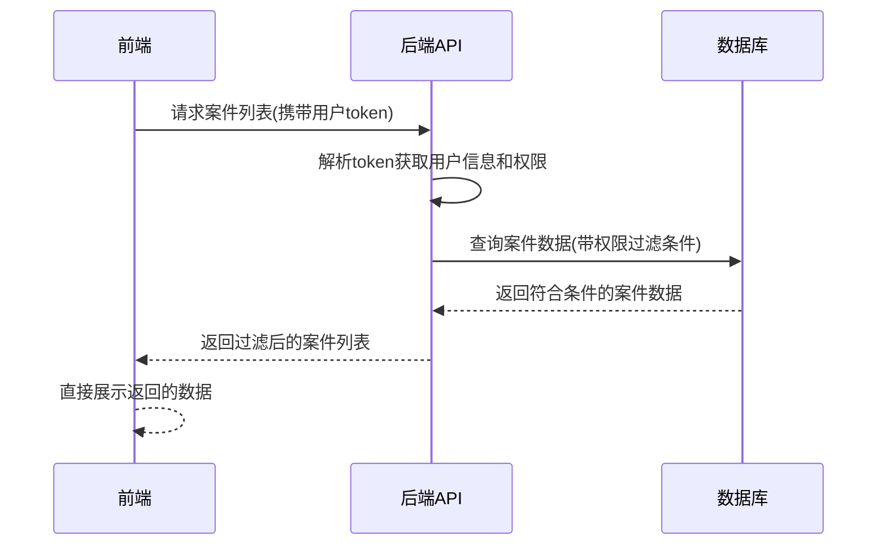

# 基于后端数据过滤的内容级控制详细说明

## 1. 实现原理

基于后端数据过滤的内容级控制是指在**后端层面**根据当前登录用户的权限，对数据库查询结果进行过滤，只返回用户有权限访问的数据。前端不需要额外处理权限逻辑，直接展示后端返回的数据即可。

### 核心思想
- **数据权限由后端控制**：后端根据用户身份和权限动态过滤数据
- **前端无感知**：前端只负责请求数据和展示，不需要处理权限逻辑
- **统一权限管理**：权限规则集中在后端配置，便于维护和更新

## 2. 具体实现流程

### 2.1 前端请求流程



### 2.2 后端处理流程

1. **身份验证**：后端解析请求中的token，获取用户ID和角色信息
2. **权限查询**：根据用户ID查询其拥有的权限列表
3. **数据过滤**：在SQL查询中添加权限过滤条件
4. **结果返回**：只返回用户有权限访问的数据

## 3. 代码实现示例

### 3.1 前端API请求

```typescript
// 案件列表API请求(位于apps/web-ele/src/api/core/case.ts)
export async function getCaseListApi(params: CaseApi.CaseQueryParams) {
  // 从localStorage获取token(实际项目中应从store获取)
  const token = localStorage.getItem('token') || 'default-token';
  
  return requestClient8085.get<CaseApi.CaseListResponse>(
    '/api/web/selectAllCase',
    {
      params: {
        ...params,
        token // 传递token给后端用于身份验证
      },
    },
  );
}
```

### 3.2 前端组件使用

```vue
<script setup lang="ts">
import { getCaseListApi } from '#/api/core/case';

// 获取案件列表
const fetchCaseList = async () => {
  loading.value = true;
  try {
    const response = await getCaseListApi({
      page: pagination.value.page,
      size: pagination.value.pageSize
    });
    
    if (response.status === '1' && response.data) {
      // 直接使用后端返回的数据，无需前端过滤
      caseList.value = response.data.records || [];
      pagination.value.itemCount = response.data.count || 0;
    }
  } catch (error) {
    ElMessage.error('获取案件列表失败');
  } finally {
    loading.value = false;
  }
};
</script>
```

### 3.3 后端数据过滤示例(SQL)

```sql
-- 假设用户表、角色表、权限表、案件表已经建立关联
-- 根据用户ID查询其有权限访问的案件
SELECT c.* 
FROM case_table c
-- 关联案件权限表
INNER JOIN case_permission cp ON c.case_id = cp.case_id
-- 关联用户角色表
INNER JOIN user_role ur ON ur.user_id = ? -- 当前用户ID
-- 关联角色权限表
INNER JOIN role_permission rp ON rp.role_id = ur.role_id
WHERE cp.permission_code = rp.permission_code
-- 其他查询条件
AND c.status = ?
LIMIT ? OFFSET ?
```

## 4. 与项目现有权限体系的结合

### 4.1 与权限指令结合

```vue
<template>
  <!-- 1. 页面级权限：通过路由meta控制访问 -->
  <!-- 2. 元素级权限：通过v-permission指令控制按钮显示 -->
  <ElButton 
    v-permission="'case:add'" 
    type="primary" 
    @click="router.push('/case-add')"
  >
    新增案件
  </ElButton>
  
  <!-- 3. 内容级权限：直接展示后端返回的数据 -->
  <ElTable :data="caseList">
    <!-- 表格列定义 -->
  </ElTable>
</template>
```

### 4.2 与访问控制状态管理结合

```typescript
import { useAccessStore } from '@vben/stores';

// 在组件中可以获取用户权限信息，用于前端辅助判断
const accessStore = useAccessStore();
const userPermissions = accessStore.accessCodes;

// 例如：根据权限动态调整请求参数
const fetchCaseList = async () => {
  const params = {
    page: 1,
    size: 10,
    // 根据用户权限动态添加参数
    includeSensitiveData: userPermissions.includes('case:sensitive:view')
  };
  
  const response = await getCaseListApi(params);
  // ...
};
```

## 5. 优势与适用场景

### 5.1 优势

1. **安全性高**：数据权限逻辑完全在后端实现，前端无法绕过
2. **前端逻辑简化**：前端不需要处理复杂的权限过滤逻辑
3. **权限集中管理**：权限规则统一在后端配置，便于维护和更新
4. **性能优化**：减少了不必要的数据传输，提高了响应速度
5. **支持复杂权限规则**：后端可以实现更复杂的权限过滤逻辑

### 5.2 适用场景

1. **数据敏感程度高**：如法律案件、财务数据等
2. **权限规则复杂**：需要基于多种条件进行数据过滤
3. **数据量较大**：前端过滤会影响性能
4. **多端应用**：统一的后端权限过滤适用于Web、移动端等多端
5. **频繁变更的权限规则**：后端集中管理便于快速调整权限

## 6. 与其他权限控制方案的对比

| 权限控制方案 | 实现层面 | 适用场景 | 优势 | 劣势 |
|-------------|----------|----------|------|------|
| 基于后端数据过滤 | 后端 | 内容级权限 | 安全性高、前端逻辑简化、权限集中管理 | 增加后端复杂度、需要后端配合 |
| 基于权限指令(v-permission) | 前端 | 元素级权限 | 使用简单、响应式更新 | 只能控制元素显示隐藏，不能真正阻止数据访问 |
| 基于路由权限 | 前端+后端 | 页面级权限 | 控制页面访问、重定向处理 | 不能控制页面内数据 |
| 基于ACL状态管理 | 前端 | 组件级权限 | 灵活、可在代码中任意位置使用 | 前端逻辑复杂、安全性较低 |

## 7. 最佳实践

### 7.1 分层权限控制

推荐结合使用多种权限控制方案，实现分层权限管理：

1. **页面级**：使用路由权限控制页面访问
2. **元素级**：使用v-permission指令控制按钮、菜单等元素显示
3. **内容级**：使用后端数据过滤控制数据访问
4. **API级**：后端API添加权限验证，防止非法请求

### 7.2 权限设计原则

1. **最小权限原则**：只授予用户完成工作所需的最小权限
2. **权限继承原则**：角色继承基础权限，减少重复配置
3. **权限审计原则**：记录权限变更和数据访问日志
4. **定期权限审查**：定期检查和更新用户权限

### 7.3 性能优化

1. **缓存权限信息**：后端缓存用户权限信息，减少数据库查询
2. **合理设计索引**：为权限过滤字段添加索引，提高查询性能
3. **分页查询**：结合分页机制，减少单次返回的数据量
4. **异步加载**：对于大量数据，使用异步加载提高前端响应速度

## 8. 法律模块案件管理的具体应用

在法律模块的案件管理页面中，基于后端数据过滤的内容级控制可以实现：

1. **按角色过滤**：
   - 律师只能查看自己承办的案件
   - 管理员可以查看所有案件
   - 实习生只能查看部分公开案件

2. **按权限过滤**：
   - 有`case:sensitive:view`权限的用户可以查看敏感案件信息
   - 有`case:archive:view`权限的用户可以查看已归档案件
   - 有`case:all:view`权限的用户可以查看所有案件

3. **按部门过滤**：
   - 不同部门的用户只能查看本部门负责的案件
   - 跨部门协作时，需要临时授予权限

## 9. 实现建议

1. **后端设计**：
   - 建立完善的用户-角色-权限数据模型
   - 在API层统一处理权限过滤
   - 使用中间件实现权限验证和过滤

2. **前端设计**：
   - 合理使用现有的权限指令和状态管理
   - 前端只做辅助性的权限判断，核心权限逻辑由后端控制
   - 优化用户体验，对于无权限的数据给出友好提示

3. **测试策略**：
   - 针对不同角色和权限组合进行测试
   - 测试边界情况，如权限变更、过期等
   - 进行安全性测试，防止越权访问

## 10. 总结

基于后端数据过滤的内容级控制是一种**安全、高效、易于维护**的权限控制方案，特别适合数据敏感、权限规则复杂的应用场景。在法律模块的案件管理页面中，结合项目现有的权限体系，可以实现多层次、细粒度的权限控制，确保数据安全和合规性。

通过合理设计和实现后端数据过滤机制，可以在保证安全性的同时，简化前端开发，提高系统的可维护性和扩展性。